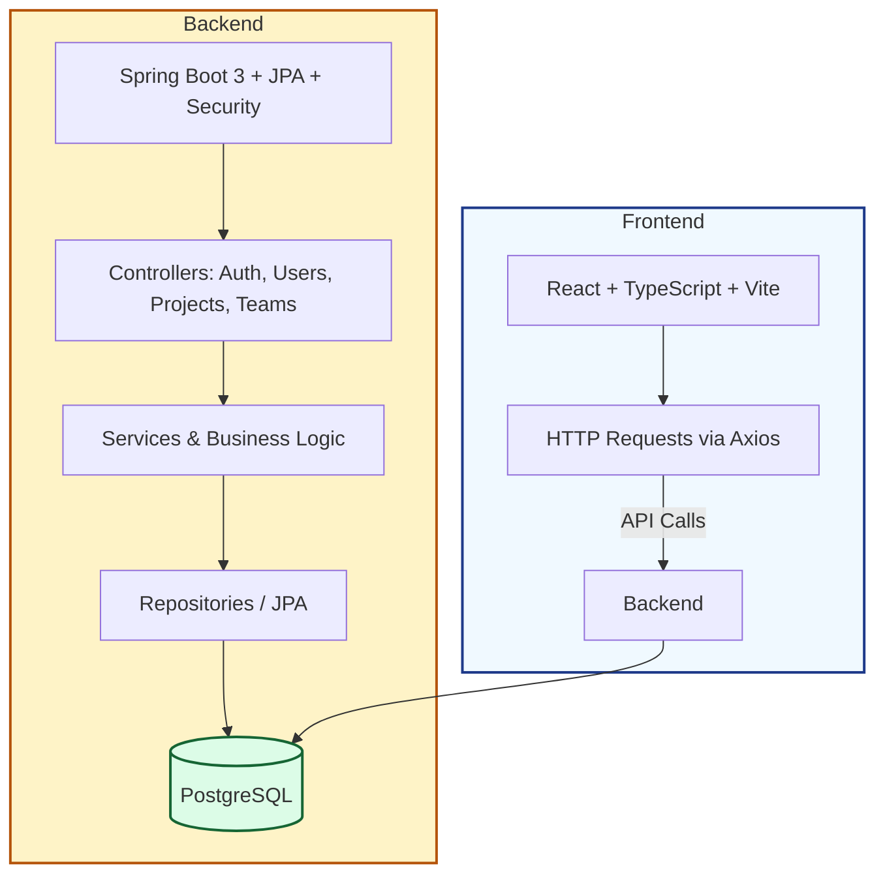

# Project Management Tool

A full‑stack Project Management application with a React + TypeScript + Vite frontend and a Spring Boot backend backed by PostgreSQL. It supports authentication, user/team management, and project operations. A ready‑to‑run Docker Compose stack is included for easy local development.

## Project Overview

- **Frontend**: SPA built with React (TypeScript), Vite, TailwindCSS, Zustand, and React Router.
- **Backend**: Spring Boot 3 (Java 17) with JPA, Spring AI, Security (JWT), and Flyway migrations.
- **Database**: PostgreSQL.
- **API Docs**: Springdoc OpenAPI UI exposed by the backend.
- **Dev Experience**: Hot reloading on the frontend, standard Maven build on the backend.

### Architecture Diagram



## Repository Structure

- **`project-management-frontend/`**: React + TypeScript + Vite app.
- **`project-management-backend/`**: Spring Boot service (Java 17, Maven).
- **`docker-compose.yml`**: Orchestrates Postgres, backend, and frontend for local development.

## Tech Stack

- **Frontend**
  - React `^19.x`, React Router `^7.x`, Zustand, TailwindCSS, Vite `^7.x`
  - Axios for HTTP, Framer Motion, Lucide icons
- **Backend**
  - Spring Boot `3.5.5` (Web, Data JPA, Security, Validation, Actuator, AOP)
  - PostgreSQL driver, Flyway for migrations
  - JWT (jjwt) for authentication
  - Springdoc OpenAPI (UI)
- **Database**: PostgreSQL (Dockerized by default)

## Prerequisites

Choose one of the two paths below.

- **With Docker (recommended)**
  - Docker Desktop 4.x+
- **Without Docker**
  - Java 17
  - Maven 3.9+
  - Node.js 18+ and npm 9+ (or pnpm/yarn)
  - A running PostgreSQL instance

## Quick Start (Docker Compose)

The root `docker-compose.yml` defines three services:
# Project Management Tool

A simple, full-stack project management application you can run locally or in Docker. The app helps manage projects, teams and tasks. This README explains how to run it, how to develop on it, and how to contribute — in plain language.

Summary:

- Frontend: React + TypeScript (Vite)
- Backend: Spring Boot (Java 21) with REST APIs
- Database: PostgreSQL
- Quick start: Docker Compose (one command)

---

## Quick facts

- Backend: Spring Boot 3.5.x targeting Java 21
- Frontend: React + TypeScript, Vite
- Database: PostgreSQL (Dockerized by default)
- Local dev: Docker Compose (recommended) or native installs

## Prerequisites

Choose how you want to run the project:

- Docker (recommended): Install Docker Desktop.
- Native (no Docker):
  - Backend: JDK 21 (install a Java 21 JDK) and Maven 3.9+
  - Frontend: Node.js 18+ and npm/yarn/pnpm

Important: The backend targets Java 21. If you build or run the backend locally, make sure `JAVA_HOME` points to a Java 21 JDK.

---

## Quick start (recommended — Docker Compose)

This is the easiest way to run everything together. From the repository root:

PowerShell (Windows):

```powershell
# Build and start frontend, backend and database
docker compose up --build

# Stop and remove containers
docker compose down
```

Open in your browser:

- Frontend: http://localhost:5173
- Backend (API): http://localhost:8080
- API docs (Swagger/OpenAPI): http://localhost:8080/swagger-ui.html

By default the Postgres container uses port 5434 on the host. The DB name, user and password used by compose are:

- DB: `project_management_db`
- User: `postgres`
- Password: `root`

Data is stored in a Docker volume so it survives container restarts.

---

## Current project snapshot (auto-detected)

Here are key versions and settings found in the code right now. These help you pick the right local setup.

- Spring Boot (parent): 3.5.5
- Backend `pom.xml` property `java.version`: 17
- Backend `Dockerfile` (build image): `maven:3.9.6-eclipse-temurin-21` (builds with Java 21)
- Backend `Dockerfile` (runtime image): `openjdk:21-slim` (Java 21 runtime)

Note: the `pom.xml` currently targets Java 17 while the Docker images use Java 21. That is fine for Docker builds (the image uses JDK 21), but if you run the backend locally without Docker you should either:

1. Install JDK 21 and set `JAVA_HOME` to Java 21 (recommended), or
2. Edit `project-management-backend/pom.xml` to change `<java.version>` to `21` and configure the Maven compiler plugin to use `<release>21`.

If you'd like, I can make that `pom.xml` change for you so the project consistently targets Java 21 across local builds and Docker.

---

---

## Run the backend locally (no Docker)

Use these steps when you want to run only the backend on your machine.

1) Install Java 21 and set `JAVA_HOME`.

PowerShell example (change the path to where you installed Java 21):

```powershell
$env:JAVA_HOME = 'C:\Program Files\Eclipse Adoptium\jdk-21'
$env:PATH = "$env:JAVA_HOME\bin;" + $env:PATH
```

2) Build and run:

```powershell
cd project-management-backend
& '.\mvnw.cmd' -DskipTests package
java -jar target/project-management-backend.jar
```

If the Maven wrapper fails (common on Windows when paths contain spaces), either:

- Install Maven and run `mvn -DskipTests package` instead of the wrapper, or
- Install your JDK in a path without spaces (e.g., `C:\jdk\jdk-21`) and set `JAVA_HOME` accordingly.

The backend listens on port 8080 by default.

---

## Run the frontend locally

```powershell
cd project-management-frontend
npm install
npm run dev
```

The frontend runs on http://localhost:5173 in development. Make sure the frontend's API URL points to the backend (`http://localhost:8080`) when running both locally.

---

## Environment variables (examples)

Backend configuration is read from Spring profiles or environment variables. Example values you can use for development:

```env
SPRING_PROFILES_ACTIVE=docker
SPRING_DATASOURCE_URL=jdbc:postgresql://postgres:5432/project_management_db
SPRING_DATASOURCE_USERNAME=postgres
SPRING_DATASOURCE_PASSWORD=root

# Optional (for AI features)
SPRING_AI_OPENAI_API_KEY=<your-api-key>
SPRING_AI_OPENAI_CHAT_MODEL=gpt-5-nano
```

Check `project-management-backend/src/main/resources/` for profile-specific configuration (files like `application-docker.yml`).

---

## Docker images used

- Build: `maven:3.9.6-eclipse-temurin-21` (builds with Java 21)
- Runtime: `openjdk:21-slim`

The Dockerfiles in this repo already use Java 21.

---

## CI / Deployment

CI is set up to build and deploy the frontend and backend from `main` (GitHub Actions). If you upgrade Java or other major dependencies, make sure CI uses Java 21 in the build steps.

---

## Developer notes & testing

- Run backend tests: `mvn test` (or use the wrapper: `.
\mvnw.cmd test` on Windows).
- Frontend tests and lint scripts are available in `project-management-frontend/package.json`.

Tip: If you see compilation errors after switching to Java 21, confirm `JAVA_HOME` points at Java 21 and your build uses `<release>21` in the Maven Compiler plugin (the backend already has this configured).

---

## Contributing

We love contributions! Short, friendly steps:

1. Open an issue explaining what you'd like to change.
2. Create a small branch from `main` (name it `fix/...` or `feature/...`).
3. Make your change, run tests locally, and keep the change focused.
4. Open a pull request and link the issue.

Formatting and tests:

- Frontend: ESLint + Prettier (see `project-management-frontend`)
- Backend: follow existing patterns; add tests for new behavior where possible

If you're new to the project, leave a short comment on an issue saying you'd like to work on it — someone will help you get started.

---

## License

See the `LICENSE` file in the repository root.

---

Next steps I can help with (pick any):

- Add `CONTRIBUTING.md` and `DEVELOPER.md` with step-by-step setup.
- Update CI workflows to explicitly use Java 21.
- Add a short Troubleshooting section with common Windows Maven wrapper fixes.
