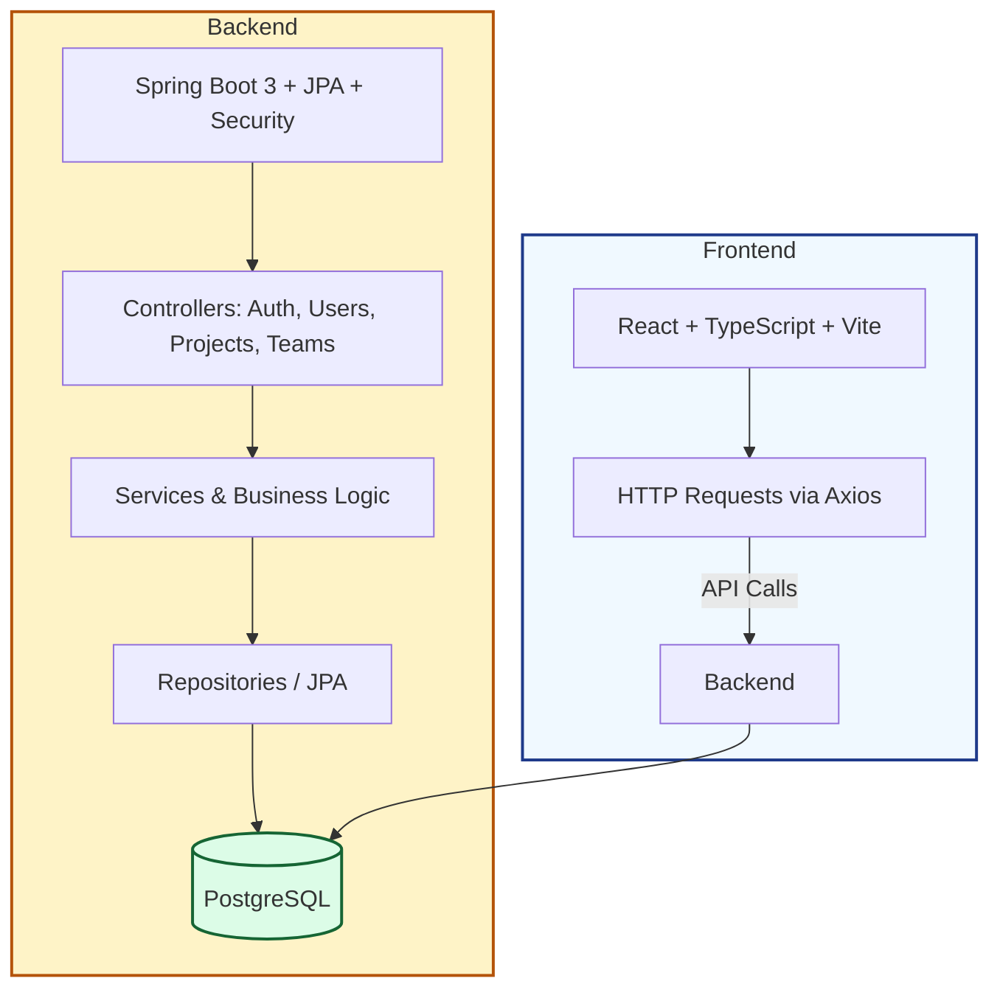

# Project Management Tool

A full‑stack Project Management application with a React + TypeScript + Vite frontend and a Spring Boot backend backed by PostgreSQL. It supports authentication, user/team management, and project operations. A ready‑to‑run Docker Compose stack is included for easy local development.

## Project Overview

- **Frontend**: SPA built with React (TypeScript), Vite, TailwindCSS, Zustand, and React Router.
- **Backend**: Spring Boot 3 (Java 17) with JPA, Spring AI, Security (JWT), and Flyway migrations.
- **Database**: PostgreSQL.
- **API Docs**: Springdoc OpenAPI UI exposed by the backend.
- **Dev Experience**: Hot reloading on the frontend, standard Maven build on the backend.

### Architecture Diagram



## Repository Structure

- **`project-management-frontend/`**: React + TypeScript + Vite app.
- **`project-management-backend/`**: Spring Boot service (Java 17, Maven).
- **`docker-compose.yml`**: Orchestrates Postgres, backend, and frontend for local development.

## Tech Stack

- **Frontend**
  - React `^19.x`, React Router `^7.x`, Zustand, TailwindCSS, Vite `^7.x`
  - Axios for HTTP, Framer Motion, Lucide icons
- **Backend**
  - Spring Boot `3.5.5` (Web, Data JPA, Security, Validation, Actuator, AOP)
  - PostgreSQL driver, Flyway for migrations
  - JWT (jjwt) for authentication
  - Springdoc OpenAPI (UI)
- **Database**: PostgreSQL (Dockerized by default)

## Prerequisites

Choose one of the two paths below.

- **With Docker (recommended)**
  - Docker Desktop 4.x+
- **Without Docker**
  - Java 17
  - Maven 3.9+
  - Node.js 18+ and npm 9+ (or pnpm/yarn)
  - A running PostgreSQL instance

## Quick Start (Docker Compose)

The root `docker-compose.yml` defines three services:

- **postgres**: `postgres:latest`, exposed on host `5434` → container `5432`
- **backend**: Spring Boot, exposed on `8080`
- **frontend**: Vite dev server, exposed on `5173`

Commands:

```bash
# From repository root
docker compose up --build

# Stop and remove containers
docker compose down
```

Once up:

- Frontend: http://localhost:5173
- Backend: http://localhost:8080
- Postgres: host=localhost port=5434 db=project_management_db user=postgres password=root
- OpenAPI UI (typical): http://localhost:8080/swagger-ui.html (or `/swagger-ui/index.html`)

Data is persisted in the named Docker volume `pgdata`.

## Local Development (without Docker)

1. **Database**

- Start PostgreSQL locally and create a database:
  - DB name: `project_management_db`
  - User: `postgres`
  - Password: `root`
  - Port: `5432` (default) or update your backend config accordingly.

2. **Backend** (`project-management-backend/`)

```bash
# In project-management-backend/
mvn spring-boot:run
# or build a jar
mvn clean package
java -jar target/project-management-backend-0.0.1-SNAPSHOT.jar
```

- Runs on http://localhost:8080 by default.
- Uses Spring Boot 3 with JPA, Flyway, Security (JWT).

3. **Frontend** (`project-management-frontend/`)

```bash
# In project-management-frontend/
npm install
npm run dev
# build/preview
npm run build
npm run preview
```

- Vite dev server runs at http://localhost:5173 (host exposed via `vite --host`).
- Ensure API base URL points to the backend (e.g., `http://localhost:8080`).

## AI Integration (Spring AI)

Implemented using **Spring AI** + **OpenAI GPT-5-Nano**, enabling:

- **Context-aware task elaboration**  
- **Project-based summaries**  
- **Expandable structure** for AI insights & analytics  

#### Environment Variables

```env
SPRING_AI_OPENAI_API_KEY=<your-api-key>
SPRING_AI_OPENAI_CHAT_MODEL=gpt-5-nano
```

## CSV Upload Feature

Admins can upload **`.csv` files** with the following headers:

```csv
name,email,role
```
The system parses and automatically adds employees to the database.

## CI/CD (GitHub Actions)

The project uses **GitHub Actions** for automated deployment:

- **Backend** → Deployed to **Render**  
- **Frontend** → Deployed to **Vercel**  
- **Triggered** on **every push to `main`**

#### Workflow Summary

| Service  | Platform | Trigger       |
|--------|----------|---------------|
| Backend  | Render   | `push` to `main` |
| Frontend | Vercel   | `push` to `main` |


## Environment Configuration

The Docker Compose file sets sensible defaults:

- Postgres environment (`docker-compose.yml`):
  - `POSTGRES_USER=postgres`
  - `POSTGRES_PASSWORD=root`
  - `POSTGRES_DB=project_management_db`

Backend typically needs (examples):

- `SPRING_PROFILES_ACTIVE=docker` (already set in Compose)
- Database connection properties per profile (e.g., `application-docker.yml` / `application.properties`).

If you maintain separate profiles, ensure the active profile has the right JDBC URL pointing to the Docker service name `postgres` when running with Compose, and to `localhost` when running natively.

## Features / Modules

Based on controllers under `project-management-backend/src/main/java/com/biswas/project_management_backend/controller/`:

- **Auth**: Authentication endpoints using JWT.
- **Users**: User CRUD and profile actions.
- **Projects**: Project CRUD and related operations.
- **Teams**: Team CRUD and membership management.

Additional backend capabilities:

- **Validation**: Request validation using Spring Validation.
- **Migrations**: Managed by Flyway on startup.
- **Observability**: Spring Boot Actuator endpoints (where enabled).

## Example Usage

- Visit the frontend at `http://localhost:5173` to use the UI.
- Explore API docs at `http://localhost:8080/swagger-ui.html` for request/response schemas.
- Use credentials created via signup/auth endpoints (implementation dependent) to authenticate in the app.

## 👥 Contributors

Thanks to these amazing people for their contributions 💪

| Contributor | Contribution |
|-------------|---------------|
| <a href="https://github.com/AbhishekPoojary"></a><br>[@Abhishek S Poojary](https://github.com/AbhishekPoojary) | Improved README.md |
| <a href="https://github.com/chathumsp02"></a><br>[@chathum_sp](https://github.com/chathumsp02) | 1. Redesigned the Login and Register pages with a modern split-screen layout, animated visuals, and improved accessibility for a polished user experience.<br><br>2. Designed the 404 page. |
| <a href="https://github.com/SalvadorArreCa"></a><br>[@SalvadorArreCa](https://github.com/SalvadorArreCa) | Refactored the service layer for improved scalability and maintainability by introducing service interfaces, moving logic to implementation classes, updating dependency injections to use interfaces, and ensuring full Spring Boot compatibility. |
| <a href="https://github.com/Ke1n3r"></a><br>[@Philipp](https://github.com/Ke1n3r) | Implemented a secure refresh token mechanism to maintain user sessions without forcing logins, including generation and storage of refresh tokens, refresh endpoint creation, token invalidation on logout, and necessary database migrations. |
| <a href="https://github.com/JEFFIN4144"></a><br>[@JEFFIN4144](https://github.com/JEFFIN4144) | Resolved all pending frontend issues, including editable member details with role-based access, enhanced Members page UI/UX, fixed PostCSS/Babel configuration, corrected build and dependency issues, and verified smooth development and runtime experience. |


## Contribution

Contributions are welcome! To work on this:

- **Discuss first**: Open an issue or comment/assign yourself before starting.
- **Branching**: Create feature branches from `main`.
- **Code style**: Follow existing patterns. Frontend uses ESLint/Prettier; run `npm run lint`.
- **Commits/PRs**: Keep changes focused, include screenshots for UI changes.
- **Testing**: Add or update tests where applicable.
